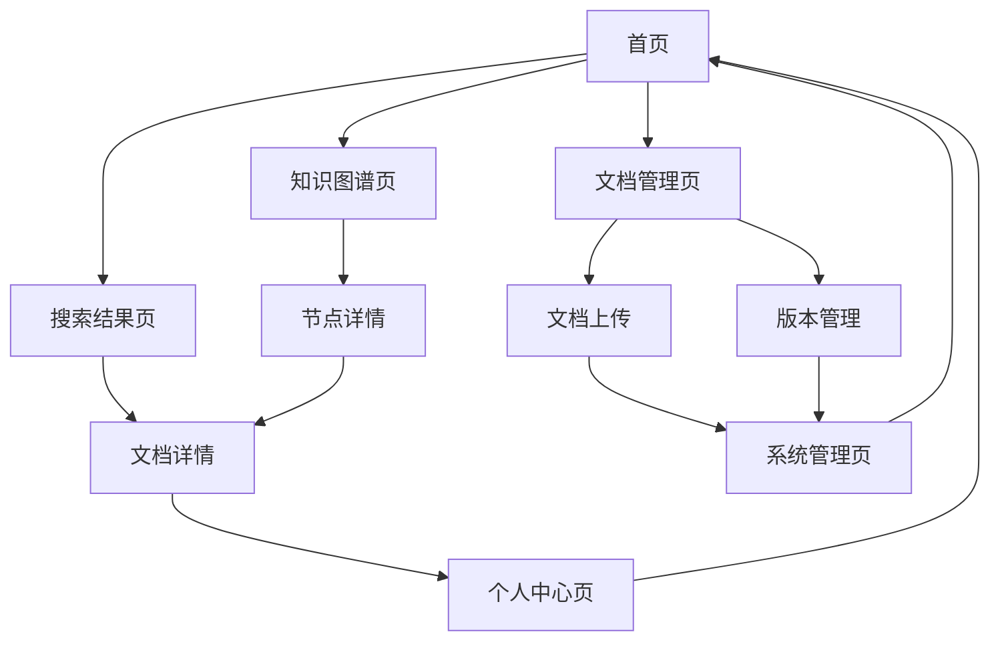

# 企业知识库管理系统 - 产品需求文档

## 1. 产品概述

企业知识库管理系统是一个面向企业内部的智能化知识管理平台，通过文档管理、全文检索和知识图谱技术，为企业提供高效的知识存储、检索、关联和可视化服务。系统支持多层级的企业组织架构，能够自动构建文档间的知识关系网络，帮助用户快速定位和获取所需知识。

- 解决企业知识分散、检索困难、关系不明确的问题
- 服务于企业各级管理人员、业务人员和技术人员
- 提升企业知识管理效率，促进知识共享和协作

## 2. 核心功能

### 2.1 用户角色

| 角色 | 注册方式 | 核心权限 |
|------|----------|----------|
| 系统管理员 | 系统预设账号 | 系统配置、用户管理、全局权限控制 |
| 知识库管理员 | 管理员邀请 | 文档审核、分类管理、知识图谱维护 |
| 部门管理员 | 上级部门授权 | 部门文档管理、成员权限分配 |
| 普通用户 | 邮箱注册+审批 | 文档浏览、搜索、下载、上传（需审核） |

### 2.2 功能模块

我们的企业知识库管理系统包含以下主要页面：

1. **首页**：系统概览、快速搜索、热门文档、知识图谱导航
2. **文档管理页**：文档上传、分类管理、版本控制、批量操作
3. **搜索结果页**：全文检索结果、高级筛选、相关推荐
4. **知识图谱页**：交互式图谱展示、节点详情、路径分析
5. **个人中心页**：用户信息、收藏夹、操作历史、权限设置
6. **系统管理页**：用户管理、权限配置、系统监控、数据统计

### 2.3 页面详情

| 页面名称 | 模块名称 | 功能描述 |
|----------|----------|----------|
| 首页 | 导航面板 | 显示企业组织架构树，支持快速定位到具体部门和业务模块 |
| 首页 | 搜索框 | 支持关键词搜索、语义搜索、高级搜索条件设置 |
| 首页 | 热门推荐 | 展示访问量高的文档、最新更新文档、相关推荐 |
| 首页 | 知识图谱预览 | 显示整体知识网络概览，支持点击进入详细图谱 |
| 文档管理页 | 文件上传 | 支持拖拽上传、批量上传、格式验证、元数据提取 |
| 文档管理页 | 分类管理 | 按企业组织架构自动分类、手动标签管理、权限设置 |
| 文档管理页 | 版本控制 | 文档版本历史、差异对比、回滚操作、变更日志 |
| 搜索结果页 | 结果展示 | 分页显示搜索结果、相关度排序、高亮关键词 |
| 搜索结果页 | 筛选面板 | 按部门、文档类型、时间范围、作者等条件筛选 |
| 搜索结果页 | 相关推荐 | 基于搜索历史和用户行为的智能推荐 |
| 知识图谱页 | 图谱渲染 | 交互式力导向图、节点缩放、拖拽操作、布局切换 |
| 知识图谱页 | 节点详情 | 点击节点显示文档详情、关联关系、操作按钮 |
| 知识图谱页 | 路径分析 | 两点间最短路径、关系链分析、影响范围评估 |
| 个人中心页 | 用户信息 | 个人资料编辑、密码修改、偏好设置 |
| 个人中心页 | 收藏管理 | 收藏文档列表、分组管理、快速访问 |
| 个人中心页 | 操作历史 | 浏览历史、下载记录、搜索历史、操作日志 |
| 系统管理页 | 用户管理 | 用户列表、角色分配、权限矩阵、批量操作 |
| 系统管理页 | 系统监控 | 系统性能指标、用户活跃度、存储使用情况 |
| 系统管理页 | 数据统计 | 文档统计、搜索热词、用户行为分析、报表导出 |

## 3. 核心流程

### 普通用户流程
用户登录后，可以通过首页的组织架构导航或搜索功能快速定位所需文档。在搜索结果页面可以进一步筛选和查看相关推荐。通过知识图谱页面可以探索文档间的关联关系，发现相关知识。用户可以收藏重要文档，在个人中心管理自己的知识资产。

### 管理员流程
管理员除了具备普通用户的所有功能外，还可以通过文档管理页面审核用户上传的文档，进行分类和权限设置。在系统管理页面可以管理用户权限，监控系统运行状态，分析用户行为数据。

### 知识图谱构建流程
系统自动扫描文档目录结构，根据企业组织架构构建基础的知识图谱。对于包含YAML元数据的文档，系统会解析其中的关系信息，丰富知识图谱的节点和边。用户可以手动标注文档间的关联关系，系统会学习这些标注来优化自动关系识别。

## 4. 用户界面设计

### 4.1 设计风格

- **主色调**：企业蓝 (#1890FF)，辅助色：浅灰 (#F5F5F5)，强调色：橙色 (#FF7A00)
- **按钮样式**：圆角矩形，主按钮采用渐变效果，次要按钮为线框样式
- **字体**：中文使用微软雅黑，英文使用 Roboto，标题 16-24px，正文 14px
- **布局风格**：卡片式设计，顶部导航栏，左侧树形菜单，主内容区域采用栅格布局
- **图标风格**：线性图标为主，配合少量面性图标，统一使用 Ant Design 图标库

### 4.2 页面设计概览

| 页面名称 | 模块名称 | UI元素 |
|----------|----------|---------|
| 首页 | 导航面板 | 左侧固定宽度300px，树形结构，支持展开收起，节点图标区分文档类型 |
| 首页 | 搜索框 | 顶部居中，宽度600px，圆角设计，带搜索建议下拉框 |
| 首页 | 热门推荐 | 卡片网格布局，每行4个卡片，卡片包含缩略图、标题、摘要、标签 |
| 知识图谱页 | 图谱画布 | 全屏画布，深色背景，节点采用不同颜色和形状区分类型，连线带箭头 |
| 文档管理页 | 上传区域 | 虚线边框的拖拽区域，支持文件预览，进度条显示上传状态 |
| 搜索结果页 | 结果列表 | 列表式布局，每项包含标题、摘要、路径、时间、相关度评分 |

### 4.3 响应式设计

系统采用桌面优先的响应式设计，主要面向PC端用户。在平板设备上，左侧导航会收起为抽屉式菜单，知识图谱支持触摸操作进行缩放和拖拽。移动端提供简化版界面，重点保障搜索和浏览功能。