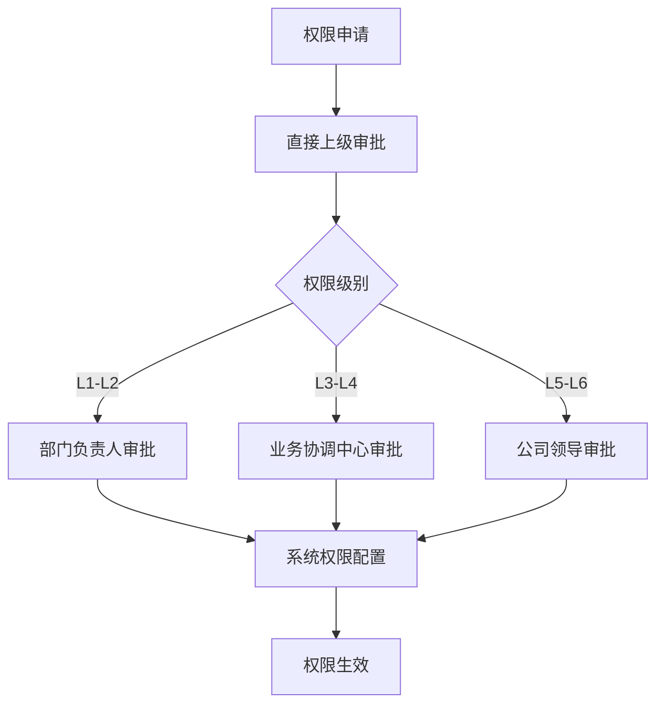
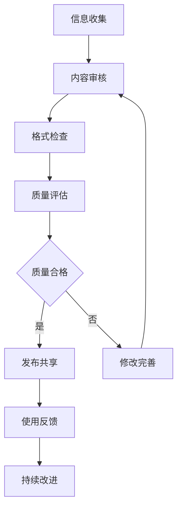

# 信息共享管理制度

## 制度概述

### 制定目的
建立规范化的信息共享管理体系，促进政府信息化业务各部门间的信息有效流通，提高工作效率，降低沟通成本，确保信息安全。

### 适用范围
本制度适用于公司政府信息化业务相关的所有部门：
- 政府关系部
- 政策法规中心
- 项目交付部
- 项目投标部
- 市场开拓部门
- 客户服务部门
- 业务协调中心

### 基本原则
1. **统一管理**: 建立统一的信息管理体系和标准
2. **分级共享**: 根据信息重要性和敏感度分级管理
3. **按需获取**: 基于工作需要和权限范围获取信息
4. **及时更新**: 确保信息的时效性和准确性
5. **安全保密**: 严格遵守信息安全和保密规定
6. **责任明确**: 明确信息提供、使用和管理责任

## 信息分类体系

### 1. 按信息性质分类

#### 1.1 公开信息 (Public)
**定义**: 可以在公司内部公开获取和使用的信息

**包含内容**:
- 公司政策制度文件
- 行业动态和市场资讯
- 公开的技术标准规范
- 培训学习资料
- 公司新闻和公告
- 已公开的项目案例

**共享范围**: 全体员工
**管理要求**: 统一发布，定期更新

#### 1.2 内部信息 (Internal)
**定义**: 仅限公司内部相关人员获取和使用的信息

**包含内容**:
- 项目进展状态报告
- 客户沟通记录
- 技术方案文档
- 内部会议纪要
- 工作计划和总结
- 部门间协作文档

**共享范围**: 相关部门和人员
**管理要求**: 按需共享，权限控制

#### 1.3 机密信息 (Confidential)
**定义**: 涉及商业机密，需要严格控制访问的信息

**包含内容**:
- 商务报价和成本信息
- 客户敏感信息
- 核心技术资料
- 合同条款细节
- 竞争对手分析
- 未公开的项目信息

**共享范围**: 授权人员
**管理要求**: 严格审批，加密传输

#### 1.4 绝密信息 (Top Secret)
**定义**: 涉及公司核心利益，最高级别保密的信息

**包含内容**:
- 公司战略规划
- 重大投资决策
- 核心商业机密
- 高层敏感信息
- 重大法律事务
- 财务敏感数据

**共享范围**: 高层管理人员
**管理要求**: 最高级别保密，专人管理

### 2. 按业务领域分类

#### 2.1 市场信息
- 政府采购信息
- 竞争对手动态
- 市场趋势分析
- 客户需求信息
- 价格行情数据

#### 2.2 技术信息
- 技术方案文档
- 系统架构设计
- 开发规范标准
- 测试验收报告
- 运维操作手册

#### 2.3 项目信息
- 项目立项文档
- 项目计划进度
- 项目变更记录
- 项目风险评估
- 项目总结报告

#### 2.4 客户信息
- 客户基本资料
- 沟通联系记录
- 需求分析文档
- 满意度调查
- 投诉处理记录

#### 2.5 政策法规信息
- 相关法律法规
- 政策解读分析
- 合规性要求
- 风险提示预警
- 案例分析总结

## 信息共享机制

### 1. 共享权限管理

#### 1.1 权限分级
| 权限级别 | 适用人员 | 信息范围 | 操作权限 |
|----------|----------|----------|----------|
| L1-基础权限 | 一般员工 | 公开信息 | 查看、下载 |
| L2-部门权限 | 部门员工 | 公开+部门内部信息 | 查看、下载、编辑 |
| L3-跨部门权限 | 项目组成员 | 公开+内部+项目相关机密 | 查看、下载、编辑、共享 |
| L4-管理权限 | 部门负责人 | 公开+内部+部门机密 | 全部操作权限 |
| L5-高级权限 | 高层管理 | 除绝密外所有信息 | 全部操作权限 |
| L6-最高权限 | 公司领导 | 所有信息 | 全部操作权限 |

#### 1.2 权限申请流程


### 2. 信息发布机制

#### 2.1 发布渠道
| 信息类型 | 主要渠道 | 备用渠道 | 发布频率 |
|----------|----------|----------|----------|
| 公司政策 | 公司门户网站 | 邮件通知 | 即时发布 |
| 项目信息 | 项目管理系统 | 工作群组 | 实时更新 |
| 技术文档 | 知识库系统 | 文档共享平台 | 版本更新 |
| 市场资讯 | 信息简报 | 内部论坛 | 定期发布 |
| 紧急通知 | 即时通讯工具 | 电话通知 | 立即发布 |

#### 2.2 发布流程
1. **信息收集**: 各部门收集整理相关信息
2. **内容审核**: 信息提供部门进行内容审核
3. **分级审批**: 根据信息级别进行相应审批
4. **格式规范**: 按照统一格式要求整理
5. **渠道发布**: 通过指定渠道进行发布
6. **接收确认**: 确认目标人员接收信息
7. **反馈收集**: 收集使用反馈和改进建议

### 3. 信息获取机制

#### 3.1 主动获取
- **定期推送**: 根据岗位需要定期推送相关信息
- **订阅服务**: 员工可订阅感兴趣的信息类别
- **检索查询**: 通过系统检索获取历史信息
- **专题汇编**: 针对特定主题整理信息合集

#### 3.2 被动获取
- **会议传达**: 通过各类会议传达重要信息
- **文件传阅**: 重要文件的传阅和学习
- **培训宣贯**: 通过培训活动传递信息
- **工作指导**: 在工作指导中传递相关信息

## 信息管理平台

### 1. 平台架构
```
信息管理平台
├── 信息门户层
│   ├── 统一门户界面
│   ├── 个性化工作台
│   ├── 移动端应用
│   └── 消息通知中心
├── 应用服务层
│   ├── 知识库管理
│   ├── 文档协作系统
│   ├── 项目信息系统
│   ├── 客户关系系统
│   └── 工作流引擎
├── 数据管理层
│   ├── 结构化数据库
│   ├── 文档存储系统
│   ├── 多媒体资源库
│   └── 数据备份系统
└── 基础设施层
    ├── 服务器集群
    ├── 网络安全设备
    ├── 存储设备
    └── 监控管理系统
```

### 2. 功能模块

#### 2.1 知识库管理
- **分类管理**: 按业务领域和信息类型分类
- **版本控制**: 文档版本管理和历史追踪
- **全文检索**: 支持全文检索和高级搜索
- **标签管理**: 通过标签实现灵活分类
- **关联推荐**: 基于内容关联推荐相关信息

#### 2.2 协作管理
- **在线编辑**: 支持多人在线协同编辑
- **评论讨论**: 文档评论和讨论功能
- **任务管理**: 信息相关任务的分配和跟踪
- **工作流**: 信息审批和发布工作流
- **通知提醒**: 自动通知和提醒功能

#### 2.3 权限管理
- **用户管理**: 用户账号和基本信息管理
- **角色管理**: 角色定义和权限配置
- **权限控制**: 细粒度的权限控制机制
- **审计日志**: 操作日志和审计追踪
- **安全认证**: 多因子认证和单点登录

### 3. 技术规范

#### 3.1 数据标准
- **元数据标准**: 统一的元数据描述规范
- **编码规范**: 信息编码和命名规范
- **格式标准**: 文档格式和模板标准
- **接口标准**: 系统间数据交换标准

#### 3.2 安全要求
- **访问控制**: 基于角色的访问控制机制
- **数据加密**: 敏感数据的加密存储和传输
- **安全审计**: 完整的安全审计和监控
- **备份恢复**: 数据备份和灾难恢复机制

## 信息安全管理

### 1. 安全分级保护

#### 1.1 保护级别
| 级别 | 信息类型 | 保护措施 | 违规后果 |
|------|----------|----------|----------|
| 一级 | 公开信息 | 基础访问控制 | 内部通报 |
| 二级 | 内部信息 | 权限控制+审计 | 警告处分 |
| 三级 | 机密信息 | 加密+严格审批 | 严重警告 |
| 四级 | 绝密信息 | 最高级保护 | 解除劳动合同 |

#### 1.2 安全措施
**技术措施**:
- 身份认证和访问控制
- 数据加密和安全传输
- 防火墙和入侵检测
- 安全审计和日志监控
- 数据备份和恢复

**管理措施**:
- 安全制度和规范
- 人员安全培训
- 定期安全检查
- 应急响应预案
- 违规处理机制

### 2. 保密管理

#### 2.1 保密责任
**个人责任**:
- 严格遵守保密制度
- 妥善保管信息资料
- 不得泄露机密信息
- 及时报告安全事件
- 接受保密教育培训

**部门责任**:
- 建立部门保密制度
- 加强人员保密教育
- 定期检查保密情况
- 处理保密违规事件
- 配合安全审计工作

#### 2.2 保密措施
**物理保密**:
- 重要文件专柜保管
- 办公区域门禁控制
- 计算机屏幕防窥视
- 废弃文件安全销毁
- 移动设备管理控制

**技术保密**:
- 文件加密和权限控制
- 网络访问监控和审计
- 邮件和通讯加密
- 移动存储设备管控
- 远程访问安全控制

## 质量控制体系

### 1. 信息质量标准

#### 1.1 质量要素
| 质量要素 | 评价标准 | 检查方法 |
|----------|----------|----------|
| 准确性 | 信息内容真实可靠 | 来源验证、交叉核实 |
| 完整性 | 信息内容完整全面 | 要素检查、缺失分析 |
| 时效性 | 信息更新及时有效 | 时间检查、更新频率 |
| 一致性 | 信息格式规范统一 | 格式检查、标准对比 |
| 可用性 | 信息易于理解使用 | 用户反馈、使用统计 |

#### 1.2 质量控制流程


### 2. 质量监控

#### 2.1 监控指标
- **信息更新率**: 信息按时更新的比例
- **信息准确率**: 信息内容准确无误的比例
- **用户满意度**: 用户对信息质量的满意程度
- **使用频率**: 信息被访问和使用的频率
- **问题反馈率**: 用户反馈问题的比例

#### 2.2 监控方法
- **自动监控**: 系统自动检测和统计
- **人工检查**: 定期人工抽查和评估
- **用户反馈**: 收集用户使用反馈
- **专项审计**: 定期专项质量审计
- **第三方评估**: 委托第三方进行评估

## 培训与考核

### 1. 培训体系

#### 1.1 培训内容
**基础培训**:
- 信息管理制度和规范
- 信息安全和保密要求
- 平台操作和使用方法
- 信息质量标准和要求

**专业培训**:
- 信息分类和标引方法
- 知识管理理论和实践
- 信息检索和利用技巧
- 协作工具使用技能

**管理培训**:
- 信息管理策略和方法
- 团队协作和沟通技巧
- 质量控制和持续改进
- 安全管理和风险控制

#### 1.2 培训方式
- **集中培训**: 定期组织集中培训班
- **在线学习**: 提供在线学习平台和资源
- **实操演练**: 通过实际操作进行练习
- **经验分享**: 组织经验交流和分享会
- **外部培训**: 参加外部专业培训课程

### 2. 考核评估

#### 2.1 考核内容
- 制度掌握程度
- 平台操作熟练度
- 信息质量水平
- 安全保密意识
- 协作配合效果

#### 2.2 考核方式
- **理论考试**: 制度和规范的理论考试
- **实操考核**: 平台操作的实际考核
- **工作评估**: 日常工作中的表现评估
- **同事评价**: 同事间的相互评价
- **客户反馈**: 客户对服务质量的反馈

## 持续改进机制

### 1. 改进来源
- 用户反馈和建议
- 质量监控发现的问题
- 技术发展和更新需求
- 业务变化和新要求
- 行业最佳实践借鉴

### 2. 改进流程
1. **问题识别**: 通过各种渠道识别改进机会
2. **需求分析**: 分析改进需求和可行性
3. **方案设计**: 设计具体的改进方案
4. **评估审批**: 评估方案效果和成本
5. **试点实施**: 选择试点进行实施验证
6. **全面推广**: 在试点成功基础上全面推广
7. **效果评估**: 评估改进效果和持续优化

### 3. 改进重点
- 信息分类和标准优化
- 平台功能和性能提升
- 用户体验和界面改进
- 安全机制和保护加强
- 流程效率和质量提升

## 附录

### A. 信息分类编码表
[详细的信息分类编码对照表]

### B. 权限申请表模板
[权限申请表格模板]

### C. 信息发布审批单
[信息发布审批单模板]

### D. 质量检查清单
[信息质量检查清单模板]

### E. 安全事件报告表
[安全事件报告表模板]

---

**制度版本**: v1.0  
**制定部门**: 业务协调中心  
**制定时间**: [YYYY-MM-DD]  
**审核人**: [姓名]  
**批准人**: [姓名]  
**生效时间**: [YYYY-MM-DD]  
**下次评审时间**: [YYYY-MM-DD]