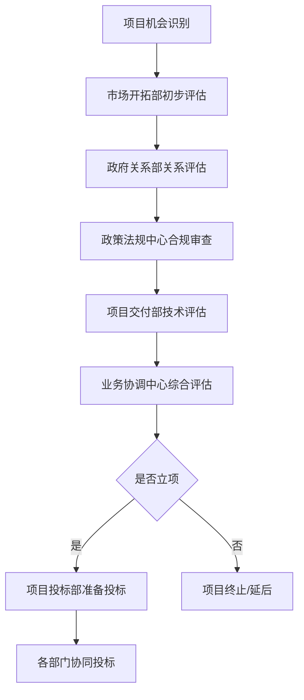

# 跨部门协作流程规范

## 文档概述

### 目的
建立标准化的跨部门协作流程，提高政府信息化项目中各部门间的协作效率，确保项目顺利推进和高质量交付。

### 适用范围
- 政府关系部
- 政策法规中心  
- 项目交付部
- 项目投标部
- 市场开拓部门
- 客户服务部门

### 基本原则
1. **统一协调**: 建立统一的协调机制和沟通渠道
2. **责任明确**: 明确各部门职责边界和协作责任
3. **流程标准**: 标准化协作流程和工作界面
4. **信息共享**: 建立有效的信息共享和传递机制
5. **持续改进**: 定期评估和优化协作效果

## 组织架构

### 业务协调中心职能
```
业务协调中心
├── 协调管理组
│   ├── 跨部门项目协调
│   ├── 资源统筹分配
│   └── 冲突调解处理
├── 信息管理组
│   ├── 信息收集整理
│   ├── 信息分发传递
│   └── 知识库维护
└── 流程优化组
    ├── 流程设计优化
    ├── 效率监控评估
    └── 持续改进推进
```

### 协调委员会构成
| 角色 | 部门 | 职责 |
|------|------|------|
| 主任委员 | 总经理/副总经理 | 重大事项决策，资源调配 |
| 副主任委员 | 业务协调中心主任 | 日常协调管理，流程执行 |
| 委员 | 各部门负责人 | 部门间协调，资源配合 |
| 秘书 | 业务协调中心 | 会议组织，记录跟踪 |

## 协作流程体系

### 1. 项目启动协作流程

#### 1.1 项目立项协调


**协调要点**:
- 各部门在48小时内完成初步评估
- 业务协调中心负责信息汇总和决策支持
- 建立项目评估标准化模板

#### 1.2 投标阶段协作
| 阶段 | 主导部门 | 协作部门 | 协作内容 | 时间要求 |
|------|----------|----------|----------|----------|
| 标书分析 | 项目投标部 | 政策法规中心、项目交付部 | 需求分析、技术方案、合规审查 | 2-3天 |
| 方案设计 | 项目交付部 | 项目投标部、政府关系部 | 技术方案、商务方案、关系维护 | 5-7天 |
| 标书编制 | 项目投标部 | 全部门 | 内容编写、审核校对、资质准备 | 3-5天 |
| 投标准备 | 项目投标部 | 政府关系部、项目交付部 | 现场准备、人员安排、材料整理 | 1-2天 |

### 2. 项目执行协作流程

#### 2.1 项目启动会议
**参与部门**: 项目交付部(主导)、政府关系部、客户服务部门、业务协调中心

**会议议程**:
1. 项目基本情况介绍
2. 各部门职责分工确认
3. 关键节点和里程碑确定
4. 沟通机制和汇报体系建立
5. 风险识别和应对预案
6. 资源需求和支持计划

**输出文档**:
- 项目启动会议纪要
- 跨部门协作计划
- 沟通矩阵表
- 风险管控清单

#### 2.2 项目执行期协作机制

**定期协调会议**:
- **周例会**: 项目组内部，项目经理主持
- **月度会**: 跨部门协调，业务协调中心主持  
- **季度会**: 高层决策会，协调委员会主持
- **专题会**: 根据需要，相关部门参与

**协作界面管理**:
| 协作界面 | 主要内容 | 责任部门 | 协作部门 | 频次 |
|----------|----------|----------|----------|------|
| 政府关系维护 | 客户关系、政策沟通 | 政府关系部 | 项目交付部 | 周 |
| 技术方案调整 | 需求变更、技术优化 | 项目交付部 | 政府关系部 | 双周 |
| 合规性审查 | 法规遵循、风险控制 | 政策法规中心 | 项目交付部 | 月 |
| 客户服务支持 | 客户满意度、问题处理 | 客户服务部门 | 项目交付部 | 周 |

### 3. 问题处理协作流程

#### 3.1 问题分类处理
```
问题类型分类：
├── 技术问题
│   ├── 一般技术问题 → 项目交付部处理
│   ├── 重大技术问题 → 项目交付部+业务协调中心
│   └── 跨项目技术问题 → 业务协调中心协调
├── 客户关系问题  
│   ├── 一般沟通问题 → 政府关系部处理
│   ├── 重大关系问题 → 政府关系部+业务协调中心
│   └── 投诉纠纷问题 → 客户服务部门+业务协调中心
├── 合规风险问题
│   ├── 一般合规问题 → 政策法规中心处理
│   ├── 重大合规风险 → 政策法规中心+业务协调中心
│   └── 法律纠纷问题 → 政策法规中心+高层决策
└── 资源协调问题
    ├── 部门内资源 → 各部门自行解决
    ├── 跨部门资源 → 业务协调中心协调
    └── 重大资源冲突 → 协调委员会决策
```

#### 3.2 问题升级机制
| 级别 | 处理时限 | 处理层级 | 升级条件 |
|------|----------|----------|----------|
| L1-一般问题 | 24小时 | 部门内部 | 常规业务问题 |
| L2-重要问题 | 48小时 | 跨部门协调 | 影响项目进度或质量 |
| L3-紧急问题 | 12小时 | 业务协调中心 | 影响客户关系或合同履行 |
| L4-重大问题 | 6小时 | 协调委员会 | 影响公司声誉或重大损失 |

### 4. 信息共享协作流程

#### 4.1 信息分类管理
```
信息分类体系：
├── 公开信息
│   ├── 公司政策制度
│   ├── 行业动态资讯
│   └── 培训学习资料
├── 内部信息
│   ├── 项目进展状态
│   ├── 客户沟通记录
│   └── 技术方案文档
├── 机密信息
│   ├── 商务报价信息
│   ├── 客户敏感信息
│   └── 核心技术资料
└── 绝密信息
    ├── 战略规划信息
    ├── 财务敏感数据
    └── 重大商业机密
```

#### 4.2 信息共享机制
**共享原则**:
- 按需知晓：根据工作需要确定信息共享范围
- 分级管理：不同级别信息采用不同共享方式
- 及时更新：确保信息的时效性和准确性
- 安全保密：严格遵守信息安全和保密要求

**共享渠道**:
1. **正式渠道**:
   - 跨部门会议
   - 正式文件传递
   - 系统平台发布
   - 邮件通知

2. **非正式渠道**:
   - 日常沟通交流
   - 工作群组讨论
   - 临时协调沟通
   - 经验分享交流

## 协作工具与平台

### 1. 沟通协作工具
| 工具类型 | 具体工具 | 使用场景 | 管理部门 |
|----------|----------|----------|----------|
| 即时通讯 | 企业微信/钉钉 | 日常沟通、紧急联络 | 业务协调中心 |
| 视频会议 | 腾讯会议/Zoom | 远程会议、客户沟通 | 业务协调中心 |
| 文档协作 | 腾讯文档/石墨文档 | 文档共享、协同编辑 | 业务协调中心 |
| 项目管理 | 禅道/Jira | 项目跟踪、任务管理 | 项目交付部 |

### 2. 信息管理平台
```
信息管理平台架构：
├── 知识库系统
│   ├── 项目文档库
│   ├── 技术资料库
│   ├── 客户信息库
│   └── 政策法规库
├── 协作管理系统
│   ├── 工作流管理
│   ├── 任务分配跟踪
│   ├── 进度监控报告
│   └── 绩效评估分析
└── 决策支持系统
    ├── 数据分析报告
    ├── 风险预警提示
    ├── 资源配置建议
    └── 决策参考信息
```

## 绩效评估体系

### 1. 协作效果评估指标
| 指标类别 | 具体指标 | 计算方法 | 目标值 |
|----------|----------|----------|--------|
| 效率指标 | 跨部门响应时间 | 平均响应时长 | ≤4小时 |
| 效率指标 | 问题解决周期 | 平均解决时长 | ≤48小时 |
| 质量指标 | 协作满意度 | 内部满意度调查 | ≥85% |
| 质量指标 | 沟通有效性 | 信息传递准确率 | ≥95% |
| 成果指标 | 项目成功率 | 按时按质完成率 | ≥90% |
| 成果指标 | 客户满意度 | 客户满意度调查 | ≥90% |

### 2. 部门协作评估
**评估维度**:
1. **主动性**: 主动参与协作，积极提供支持
2. **及时性**: 按时响应协作需求，及时完成任务
3. **有效性**: 协作质量高，达到预期效果
4. **创新性**: 提出改进建议，优化协作方式

**评估方法**:
- 月度自评：各部门自我评估协作表现
- 互评打分：相关部门互相评估协作效果
- 客户反馈：收集客户对协作效果的反馈
- 数据分析：基于客观数据进行量化评估

### 3. 激励机制
**正向激励**:
- 协作优秀部门/个人表彰
- 协作创新奖励
- 绩效考核加分
- 晋升优先考虑

**改进措施**:
- 协作问题分析
- 改进计划制定
- 培训能力提升
- 流程优化调整

## 持续改进机制

### 1. 定期评估
**评估周期**:
- 月度评估：协作效果和问题分析
- 季度评估：流程优化和改进建议
- 年度评估：整体协作体系评估

**评估内容**:
- 协作流程执行情况
- 协作效果和满意度
- 存在问题和改进空间
- 最佳实践和经验总结

### 2. 优化改进
**改进来源**:
- 定期评估发现的问题
- 各部门提出的建议
- 客户反馈的意见
- 行业最佳实践借鉴

**改进流程**:
1. 问题识别和分析
2. 改进方案设计
3. 方案评估和审批
4. 试点实施和验证
5. 全面推广和应用
6. 效果跟踪和评估

### 3. 知识管理
**经验总结**:
- 成功协作案例收集
- 最佳实践提炼
- 经验教训总结
- 知识库更新维护

**知识分享**:
- 定期经验分享会
- 协作技能培训
- 案例研讨分析
- 跨部门学习交流

## 培训与能力建设

### 1. 协作技能培训
**培训内容**:
- 跨部门协作理念和方法
- 沟通技巧和冲突处理
- 项目管理和团队协作
- 信息技术工具使用

**培训方式**:
- 集中培训：定期组织集中培训
- 在线学习：提供在线学习资源
- 实践演练：通过实际项目练习
- 经验分享：组织经验交流会

### 2. 能力评估
**评估内容**:
- 协作意识和态度
- 沟通协调能力
- 问题解决能力
- 团队合作精神

**评估方式**:
- 360度评估
- 实际工作表现
- 培训考核结果
- 客户反馈评价

## 附录

### A. 协作流程图模板
[此处可插入具体的流程图模板]

### B. 沟通记录表模板
[此处可插入沟通记录表格模板]

### C. 问题处理单模板
[此处可插入问题处理单模板]

### D. 协作评估表模板
[此处可插入协作评估表格模板]

---

**文档版本**: v1.0  
**制定部门**: 业务协调中心  
**制定时间**: [YYYY-MM-DD]  
**审核人**: [姓名]  
**批准人**: [姓名]  
**生效时间**: [YYYY-MM-DD]  
**下次评审时间**: [YYYY-MM-DD]