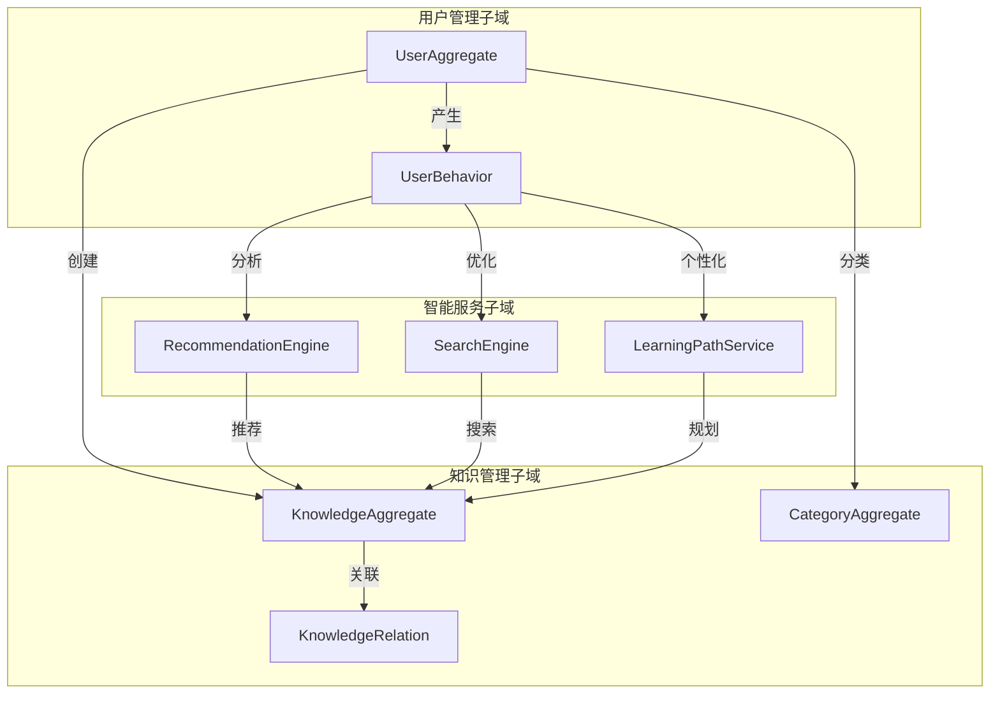
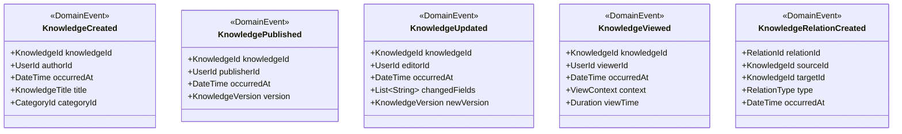
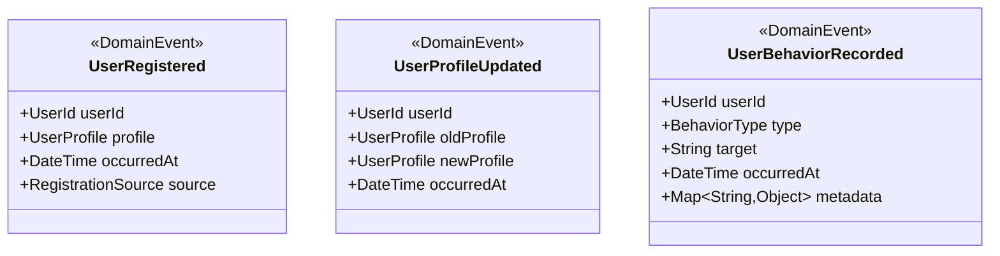
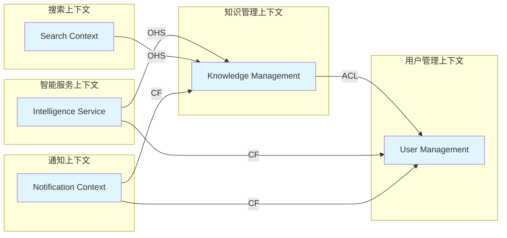

# 领域模型图

## 文档信息
- **文档版本**: v1.0
- **创建日期**: 2024-01-15
- **最后更新**: 2024-01-15
- **负责人**: 架构师
- **审核人**: 领域专家

## 领域模型概述

知识库系统基于领域驱动设计(DDD)方法构建，核心领域模型围绕知识管理、用户管理、智能服务三个主要子域展开。

## 核心领域模型

### 1. 知识管理子域 (Knowledge Management)

```mermaid
classDiagram
    class KnowledgeAggregate {
        <<AggregateRoot>>
        +KnowledgeId id
        +KnowledgeTitle title
        +KnowledgeContent content
        +KnowledgeStatus status
        +CategoryId categoryId
        +UserId authorId
        +List~Tag~ tags
        +CreatedAt createdAt
        +UpdatedAt updatedAt
        +publish()
        +archive()
        +addTag(Tag)
        +removeTag(Tag)
        +updateContent(KnowledgeContent)
    }

    class KnowledgeId {
        <<ValueObject>>
        +String value
        +equals(KnowledgeId)
        +hashCode()
    }

    class KnowledgeTitle {
        <<ValueObject>>
        +String value
        +validate()
    }

    class KnowledgeContent {
        <<ValueObject>>
        +String markdown
        +String html
        +List~Attachment~ attachments
        +convertToHtml()
        +extractKeywords()
    }

    class KnowledgeStatus {
        <<ValueObject>>
        +StatusType type
        +DateTime timestamp
        +String reason
        +isPublished()
        +isDraft()
    }

    class Tag {
        <<ValueObject>>
        +String name
        +String color
        +TagType type
    }

    class Category {
        <<Entity>>
        +CategoryId id
        +CategoryName name
        +CategoryId parentId
        +List~Category~ children
        +addChild(Category)
        +getPath()
    }

    class KnowledgeRelation {
        <<Entity>>
        +RelationId id
        +KnowledgeId sourceId
        +KnowledgeId targetId
        +RelationType type
        +Double weight
        +String description
    }

    KnowledgeAggregate ||--|| KnowledgeId
    KnowledgeAggregate ||--|| KnowledgeTitle
    KnowledgeAggregate ||--|| KnowledgeContent
    KnowledgeAggregate ||--|| KnowledgeStatus
    KnowledgeAggregate ||--o{ Tag
    KnowledgeAggregate }o--|| Category
    KnowledgeRelation }o--|| KnowledgeAggregate
```

### 2. 用户管理子域 (User Management)

```mermaid
classDiagram
    class UserAggregate {
        <<AggregateRoot>>
        +UserId id
        +UserProfile profile
        +UserPreferences preferences
        +List~Role~ roles
        +UserStatus status
        +CreatedAt createdAt
        +LastLoginAt lastLoginAt
        +updateProfile(UserProfile)
        +addRole(Role)
        +removeRole(Role)
        +updatePreferences(UserPreferences)
        +activate()
        +deactivate()
    }

    class UserId {
        <<ValueObject>>
        +String value
        +equals(UserId)
        +hashCode()
    }

    class UserProfile {
        <<ValueObject>>
        +String username
        +String email
        +String displayName
        +String avatar
        +String bio
        +validate()
    }

    class UserPreferences {
        <<ValueObject>>
        +String language
        +String theme
        +NotificationSettings notifications
        +PrivacySettings privacy
        +Map~String,Object~ customSettings
    }

    class Role {
        <<ValueObject>>
        +String name
        +List~Permission~ permissions
        +hasPermission(Permission)
    }

    class Permission {
        <<ValueObject>>
        +String resource
        +String action
        +String scope
    }

    class UserBehavior {
        <<Entity>>
        +BehaviorId id
        +UserId userId
        +BehaviorType type
        +String target
        +DateTime timestamp
        +Map~String,Object~ metadata
    }

    UserAggregate ||--|| UserId
    UserAggregate ||--|| UserProfile
    UserAggregate ||--|| UserPreferences
    UserAggregate ||--o{ Role
    Role ||--o{ Permission
    UserBehavior }o--|| UserAggregate
```

### 3. 智能服务子域 (Intelligence Service)

```mermaid
classDiagram
    class RecommendationEngine {
        <<DomainService>>
        +generateRecommendations(UserId, Context)
        +updateUserProfile(UserId, List~Behavior~)
        +calculateSimilarity(KnowledgeId, KnowledgeId)
    }

    class SearchEngine {
        <<DomainService>>
        +search(SearchQuery)
        +indexKnowledge(KnowledgeAggregate)
        +updateIndex(KnowledgeId)
        +deleteFromIndex(KnowledgeId)
    }

    class LearningPathService {
        <<DomainService>>
        +generateLearningPath(UserId, SkillTarget)
        +updateProgress(UserId, KnowledgeId)
        +recommendNextStep(UserId)
    }

    class SearchQuery {
        <<ValueObject>>
        +String keywords
        +List~Filter~ filters
        +SortCriteria sort
        +Pagination pagination
        +validate()
    }

    class Recommendation {
        <<ValueObject>>
        +KnowledgeId knowledgeId
        +Double score
        +String reason
        +RecommendationType type
    }

    class LearningPath {
        <<ValueObject>>
        +List~LearningStep~ steps
        +SkillTarget target
        +EstimatedDuration duration
        +DifficultyLevel difficulty
    }

    class LearningStep {
        <<ValueObject>>
        +KnowledgeId knowledgeId
        +Integer order
        +List~Prerequisite~ prerequisites
        +EstimatedTime time
    }

    RecommendationEngine ..> Recommendation
    SearchEngine ..> SearchQuery
    LearningPathService ..> LearningPath
    LearningPath ||--o{ LearningStep
```

## 聚合关系图



## 领域事件模型

### 知识管理事件



### 用户管理事件



## 仓储接口定义

### 知识仓储

```typescript
interface KnowledgeRepository {
    save(knowledge: KnowledgeAggregate): Promise<void>
    findById(id: KnowledgeId): Promise<KnowledgeAggregate | null>
    findByAuthor(authorId: UserId): Promise<KnowledgeAggregate[]>
    findByCategory(categoryId: CategoryId): Promise<KnowledgeAggregate[]>
    findByTags(tags: Tag[]): Promise<KnowledgeAggregate[]>
    search(query: SearchQuery): Promise<SearchResult>
    delete(id: KnowledgeId): Promise<void>
}

interface CategoryRepository {
    save(category: Category): Promise<void>
    findById(id: CategoryId): Promise<Category | null>
    findByParent(parentId: CategoryId): Promise<Category[]>
    findRootCategories(): Promise<Category[]>
    delete(id: CategoryId): Promise<void>
}

interface KnowledgeRelationRepository {
    save(relation: KnowledgeRelation): Promise<void>
    findBySource(sourceId: KnowledgeId): Promise<KnowledgeRelation[]>
    findByTarget(targetId: KnowledgeId): Promise<KnowledgeRelation[]>
    findByType(type: RelationType): Promise<KnowledgeRelation[]>
    delete(id: RelationId): Promise<void>
}
```

### 用户仓储

```typescript
interface UserRepository {
    save(user: UserAggregate): Promise<void>
    findById(id: UserId): Promise<UserAggregate | null>
    findByEmail(email: string): Promise<UserAggregate | null>
    findByUsername(username: string): Promise<UserAggregate | null>
    findActiveUsers(): Promise<UserAggregate[]>
    delete(id: UserId): Promise<void>
}

interface UserBehaviorRepository {
    save(behavior: UserBehavior): Promise<void>
    findByUser(userId: UserId, limit?: number): Promise<UserBehavior[]>
    findByType(type: BehaviorType): Promise<UserBehavior[]>
    findByTimeRange(start: DateTime, end: DateTime): Promise<UserBehavior[]>
    deleteOldBehaviors(before: DateTime): Promise<void>
}
```

## 领域服务接口

### 推荐服务

```typescript
interface RecommendationService {
    generatePersonalizedRecommendations(
        userId: UserId, 
        context: RecommendationContext
    ): Promise<Recommendation[]>
    
    generateSimilarKnowledge(
        knowledgeId: KnowledgeId
    ): Promise<KnowledgeAggregate[]>
    
    updateUserInterests(
        userId: UserId, 
        behaviors: UserBehavior[]
    ): Promise<void>
}
```

### 搜索服务

```typescript
interface SearchService {
    search(query: SearchQuery): Promise<SearchResult>
    indexKnowledge(knowledge: KnowledgeAggregate): Promise<void>
    updateIndex(knowledgeId: KnowledgeId): Promise<void>
    deleteFromIndex(knowledgeId: KnowledgeId): Promise<void>
    suggestKeywords(partial: string): Promise<string[]>
}
```

### 学习路径服务

```typescript
interface LearningPathService {
    generateLearningPath(
        userId: UserId, 
        skillTarget: SkillTarget
    ): Promise<LearningPath>
    
    updateLearningProgress(
        userId: UserId, 
        knowledgeId: KnowledgeId, 
        progress: LearningProgress
    ): Promise<void>
    
    recommendNextLearningStep(
        userId: UserId
    ): Promise<LearningStep | null>
}
```

## 限界上下文映射



**关系说明**:
- **ACL** (Anti-Corruption Layer): 防腐层
- **OHS** (Open Host Service): 开放主机服务
- **CF** (Conformist): 遵奉者
- **SK** (Shared Kernel): 共享内核

## 数据一致性策略

### 最终一致性场景

1. **知识发布事件**: 知识发布后，搜索索引和推荐系统异步更新
2. **用户行为记录**: 用户行为实时记录，分析结果异步更新
3. **统计数据更新**: 知识浏览量、用户活跃度等统计数据定期更新

### 强一致性场景

1. **知识内容修改**: 知识内容的修改必须保证版本一致性
2. **用户权限变更**: 用户权限的变更必须立即生效
3. **关键业务操作**: 知识发布、用户注册等关键操作保证强一致性

## 版本历史

| 版本 | 日期 | 修改内容 | 修改人 |
|------|------|----------|--------|
| v1.0 | 2024-01-15 | 初始版本，定义核心领域模型 | 架构师 |

## 审核记录

| 审核人 | 审核日期 | 审核意见 | 状态 |
|--------|----------|----------|------|
| 领域专家 | 2024-01-15 | 领域模型设计合理，符合DDD原则 | 通过 |
| 技术负责人 | 2024-01-15 | 技术实现可行，接口设计清晰 | 通过 |