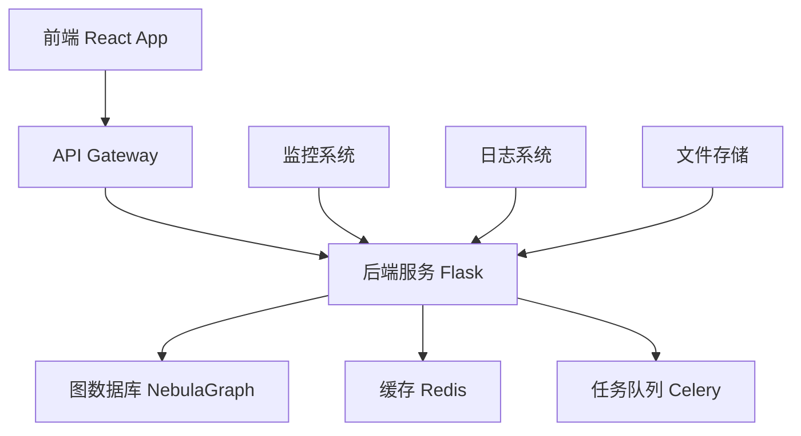

# Data-Fabric 项目文档

欢迎来到 Data-Fabric 知识图谱应用的官方文档！

## 🚀 项目概述

Data-Fabric 是一个基于现代技术栈构建的知识图谱应用，旨在提供高效的数据管理和知识发现能力。

### 核心特性

- 🔍 **智能搜索**: 基于图数据库的语义搜索
- 📊 **数据可视化**: 交互式知识图谱展示
- 🔄 **实时同步**: 数据变更实时更新
- 🛡️ **安全可靠**: 企业级安全保障
- 🎯 **高性能**: 优化的查询和渲染性能

## 📚 文档导航

### 快速开始
- [安装指南](./installation.md)
- [快速入门](./quick-start.md)
- [配置说明](./configuration.md)

### 开发文档
- [架构设计](./architecture.md)
- [API 文档](./api.md)
- [前端开发](./frontend.md)
- [后端开发](./backend.md)

### 部署运维
- [部署指南](./deployment.md)
- [监控告警](./monitoring.md)
- [故障排查](./troubleshooting.md)

### 贡献指南
- [开发规范](./contributing.md)
- [代码审查](./code-review.md)
- [发布流程](./release.md)

## 🛠️ 技术栈

### 前端技术
- **框架**: React 18 + TypeScript 5
- **构建工具**: Vite 5
- **状态管理**: Zustand
- **UI组件**: Ant Design
- **样式方案**: Tailwind CSS

### 后端技术
- **框架**: Flask 3.0 + Flask-RESTX
- **语言**: Python 3.11+
- **图数据库**: NebulaGraph
- **缓存**: Redis 7.x
- **任务队列**: Celery

### 基础设施
- **容器化**: Docker + Docker Compose
- **编排**: Kubernetes
- **CI/CD**: GitHub Actions
- **监控**: Prometheus + Grafana

## 🏗️ 系统架构

## 📈 性能指标

- **响应时间**: < 200ms (95th percentile)
- **并发用户**: 支持 1000+ 并发
- **数据规模**: 支持千万级节点和边
- **可用性**: 99.9% SLA

## 🔗 相关链接

- [GitHub 仓库](https://github.com/aime4eve/Data-Fabric)
- [在线演示](https://demo.data-fabric.example.com)
- [API 文档](https://api.data-fabric.example.com/docs)
- [问题反馈](https://github.com/aime4eve/Data-Fabric/issues)

## 📞 联系我们

如果您有任何问题或建议，请通过以下方式联系我们：

- 📧 Email: support@data-fabric.example.com
- 💬 讨论区: [GitHub Discussions](https://github.com/aime4eve/Data-Fabric/discussions)
- 🐛 Bug 报告: [GitHub Issues](https://github.com/aime4eve/Data-Fabric/issues)

---

*最后更新: {{ site.time | date: "%Y-%m-%d" }}*